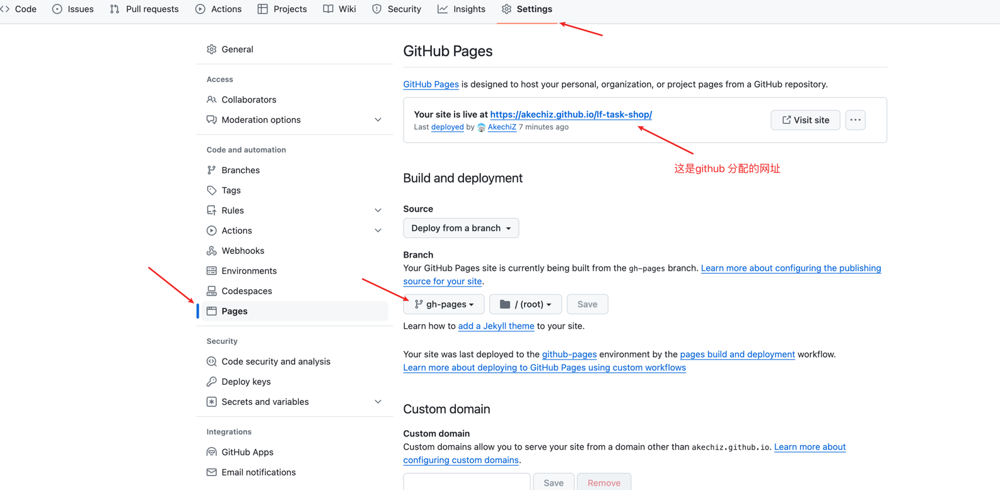

# vite 快速发布项目在Github pages

### 配置

vite.config.js
```agsl
import { defineConfig } from 'vite';
export default defineConfig({
  base: '/lf-task-shop/',
});
```

安装插件 npm install gh-pages

package.json
```agsl
  "scripts": {
    "dev": "vite --open",
    "start": "vite --open",
    "host": "vite --open --host",
    "build": "vite build",
    "preview": "vite preview",
    "predeploy": "npm run build",
    "deploy": "gh-pages -d dist",
  }
```

### 运行
1. 创建一个新分支：git checkout -b gh-pages，注意，分支名必须为gh-pages
2. 将分支push到仓库：git push -u origin gh-pages
3. 切换到主分支: git checkout main
4. 依次运行preview predeploy deploy 三个script

### Github 相关

1. 打开对应仓库的setting
2. 点击左边的 pages
3. 切换分支到 gh-pages
4. 需要等一段事件 刷新网页后github将分配网址给你